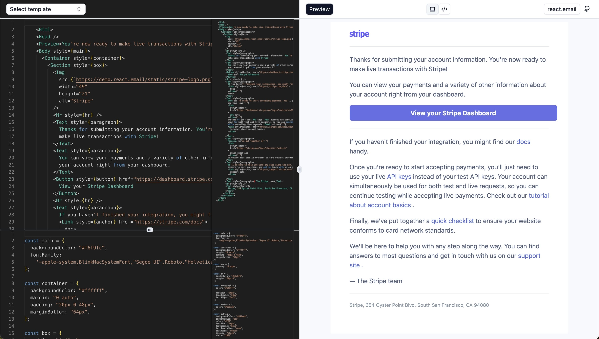

# react-email previewer

Live preview emails developed with react.email

Live demo - https://barryloh.github.io/react-email-previewer

## Features

1. Input email templates with [react.email](https://react.email/) and preview how it looks like
2. Input reusable styles as variables. Spread syntax is supported

## Limitations

1. Customised payload to attach with email
2. Hidden bugs 😬 this app was put together in one day to help with quick development of emails

## License

MIT

